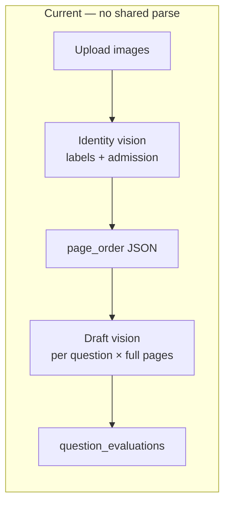
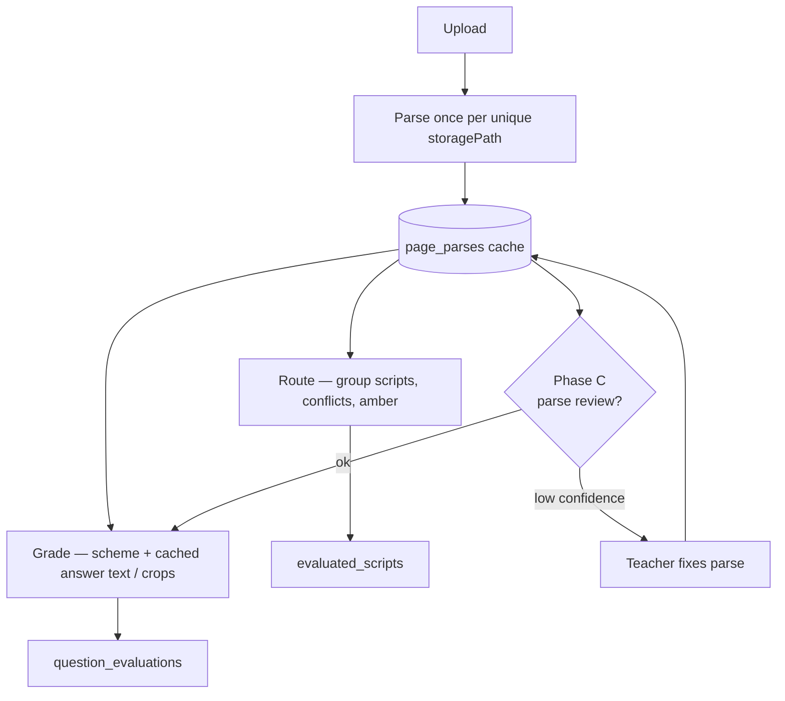
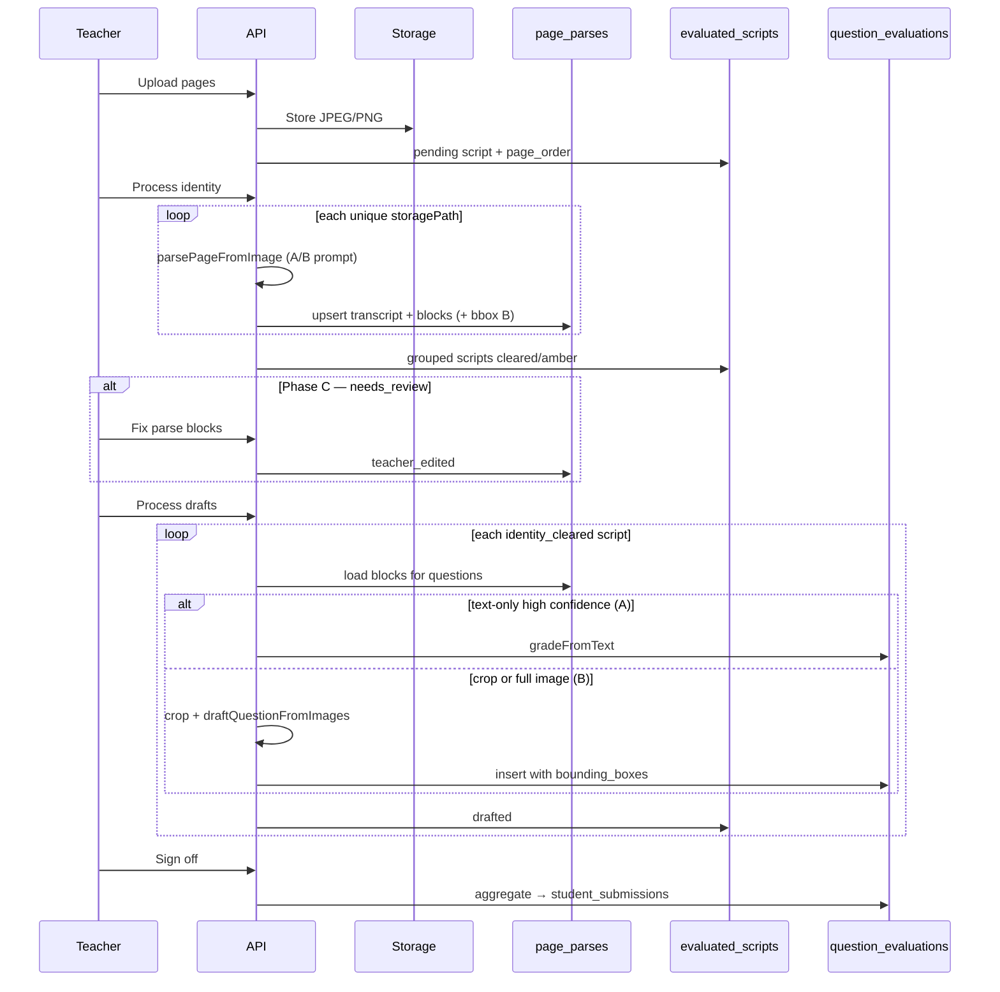

# Evaluation page parse cache — three-phase design

**Status:** Superseded by [ADR-005](adr-005-eval-direct-multimodal.md) (2026-08-02). Direct multimodal grading replaces parse-cache architecture.

**Status (historical):** Proposed (design doc)  
**Related:** ADR-003 (vision tiering), Epic F (evaluation rehaul), PSL-8 family (Sprint 5 eval)  
**Audience:** Engineering — implementation planning for post–Sprint 5 eval pipeline improvements

## Summary

Today the evaluation pipeline runs **independent vision passes** on the same scanned pages:

1. **Identity** — admission number + question labels per page (`read-script-page.ts`)
2. **Draft** — marks, feedback, student answer per question (`draft-question.ts`)

The only shared artifact is lightweight metadata in `evaluated_scripts.page_order` (`questionNumbers`, `readAdmissionNumber`). Grading does **not** reuse identity’s read of student work; it re-downloads images and asks the model again.

This document specifies a **page parse cache**: one canonical interpretation of each uploaded page, persisted and versioned, consumed by routing (identity), grading (draft/re-eval), and teacher review.

Delivery is phased:

| Phase | Name | Adds | Primary win |
|-------|------|------|-------------|
| **A** | Transcript cache | Text + labels per page/question | Cost, consistency, re-grade without re-OCR |
| **B** | Layout cache | Regions (bounding boxes) per question block | Spatial isolation, crop-based grading, UI highlights |
| **C** | Teacher parse edit | Human gate on parse before auto-draft | Trust, fewer wrong marks, cheaper downstream fixes |

Phases are **additive**. Ship A before B; B before C UI depends on regions. Each phase should be usable without the next.

---

## Problem (current pipeline)



| Gap | Effect |
|-----|--------|
| Duplicate vision on same pixels | Higher cost and latency (1/page + 1/question typical) |
| No shared student-answer text | Identity and draft can disagree on what belongs to Q1a |
| Full-page re-send on re-eval | `reevaluate-question.ts` sends all page images again |
| Labels-only routing | `pagesForQuestion` trusts identity labels; no answer transcript |
| No parse-quality gate | Amber is identity-only; bad handwriting still triggers N grade calls |

**Existing code seams** (extension points):

| Step | Module |
|------|--------|
| Upload + dedupe | `src/app/api/evaluation-batches/[batchId]/upload/route.ts`, `content-hash.ts` |
| Identity read | `read-script-page.ts`, `identity.ts`, `group-pages.ts` |
| Draft | `drafts.ts`, `draft-question.ts`, `page-images.ts` |
| Re-eval | `reevaluate-question.ts` |
| Review UI | `eval-review-workspace.tsx`, `identity-review-panel.tsx` |
| Types | `EvaluatedScriptPage` in `src/types/database.ts` |

---

## Target architecture



**Principles**

1. **Parse once, consume many** — identity, draft, re-eval, and UI read the same artifact.
2. **Versioned** — `parse_version` + `model_id` so re-parse invalidates downstream drafts safely.
3. **Confidence-aware** — low-confidence blocks route to amber (Phase C) instead of silent auto-grade.
4. **Images remain source of truth** — cache is derived; storage paths unchanged; re-parse always possible.
5. **Backward compatible rollout** — batches without cache rows fall back to today’s behavior.

---

## Shared data model

### New table: `page_parses`

One row per **unique blob** in a batch (keyed by `batch_id` + `storage_path`; dedupe via existing `contentHash` rules).

```sql
-- Illustrative; finalize in migration + types/database.ts
create table page_parses (
  id uuid primary key default gen_random_uuid(),
  batch_id uuid not null references evaluation_batches(id) on delete cascade,
  storage_path text not null,
  content_hash text,                    -- mirrors upload dedupe
  parse_version text not null,          -- e.g. 'v1', 'v2-layout'
  model_id text not null,               -- e.g. gemini-3.1-flash-lite
  admission_number text,
  admission_confidence numeric(3,2),    -- 0–1 optional
  raw_transcript text,                  -- Phase A: full page text
  blocks jsonb not null default '[]',   -- Phase A+: structured blocks (see below)
  page_confidence numeric(3,2),
  status text not null default 'parsed', -- parsed | needs_review | teacher_edited | failed
  error_message text,
  parsed_at timestamptz not null default now(),
  unique (batch_id, storage_path)
);
```

### Block shape (evolves by phase)

```ts
type PageParseBlock = {
  /** Normalized label: "1", "1a", "2(i)" */
  questionLabel: string | null;
  /** Phase A: extracted answer/working as text */
  text: string;
  /** Phase B: normalized 0–1000 coords, origin top-left */
  bbox?: { ymin: number; xmin: number; ymax: number; xmax: number };
  /** answer | working | diagram | header | unknown */
  blockType: "answer" | "working" | "diagram" | "header" | "unknown";
  confidence?: number;
  /** Phase C: teacher override */
  teacherEdited?: boolean;
};
```

### `EvaluatedScriptPage` (existing JSONB)

Keep `page_order` as **references** to storage paths + routing flags. Optionally add:

```ts
parseId?: string;           // FK to page_parses.id when resolved
parseStatus?: "ok" | "needs_review" | "failed";
```

Do **not** duplicate full transcripts inside every script row; join via `storage_path`.

### `question_evaluations` (Phase B+)

Align with Epic F proposal — store regions used for grading:

```ts
bounding_boxes?: Array<{
  storagePath: string;
  ymin: number;
  xmin: number;
  ymax: number;
  xmax: number;
}>;
parse_snapshot_id?: string;  // optional: block ids or parse row version at grade time
```

---

## Phase A — Transcript cache

### Goal

After upload (or at identity time), run **one rich vision pass per page** that extracts:

- Admission number (same as today, but stored on parse row)
- Question labels visible on the page
- **Per-question text chunks** (student working / answers)
- **Full-page raw transcript** (fallback + audit)

Identity and draft **read from `page_parses`**, not separate prompts on the same task.

### Parse prompt (conceptual)

Single call per page, JSON output:

```json
{
  "admission_number": "ADM-042",
  "question_numbers": ["1a", "1b", "2"],
  "blocks": [
    { "questionLabel": "1a", "blockType": "answer", "text": "..." },
    { "questionLabel": "1b", "blockType": "working", "text": "..." }
  ],
  "raw_transcript": "..."
}
```

Reuse normalization: `normalizeAdmissionNumber`, `parseQuestionLabels`, `normalizeQuestionLabel`.

### Pipeline changes

| Stage | Today | Phase A |
|-------|-------|---------|
| Upload | Store image, pending script | Unchanged |
| Identity | `readScriptPageFromImage` → group | `parsePageFromImage` → upsert `page_parses` → group from cache |
| Draft | `draftQuestionFromImages(full pages)` | Prefer **text grading**: scheme + cached `blocks[].text`; vision only if `blockType === "diagram"` or low confidence |
| Re-eval | Full page images | Cached text + instruction; optional vision if diagram |

**New modules (suggested)**

- `src/lib/evaluation/parse-page.ts` — vision call + `parsePageJson`
- `src/lib/evaluation/page-parse-cache.ts` — load/upsert/list by batch
- `src/lib/evaluation/grade-from-parse.ts` — text-first grading (cheaper model or same vision with text-only prompt)

**Draft flow (Phase A)**

```
processBatchDrafts
  → load page_parses for script pages
  → uniqueQuestionLabelsFromPages OR blocks[].questionLabel
  → for each label:
       blocks = getBlocksForQuestion(parses, label)
       if all text + high confidence → gradeFromText(blocks, scheme)
       else → draftQuestionFromImages(crops or full pages)  // fallback
```

### Gates and invalidation

- **Re-parse trigger:** teacher requests, `parse_version` bump, or model upgrade (`EVAL_VISION_MODEL` change).
- **Draft invalidation:** if parse row updated after script was `drafted`, mark script `identity_cleared` or new status `parse_stale` and require re-draft.
- **Amber (light):** page-level `page_confidence` or missing admission → existing identity amber rules unchanged.

### Acceptance criteria (Phase A)

- [ ] One vision call per unique `storage_path` per batch at identity time (verified in tests/logs).
- [ ] `processBatchIdentity` groups scripts using cached admission + labels (behavior parity with today).
- [ ] `processBatchDrafts` uses cached block text for ≥80% of questions on clean pilot scripts (metric; tune in QA).
- [ ] Re-eval with instruction does not re-download page images when cached text exists and no diagram blocks.
- [ ] Batches without `page_parses` rows still work via legacy path.

### Risks (Phase A)

| Risk | Mitigation |
|------|------------|
| Wrong transcript poisons all grades | Per-block confidence; fallback to vision; Phase C for correction |
| Diagram-heavy subjects | `blockType: diagram` forces image grade path |
| Schema migration | Additive table; no change to sign-off tables |

---

## Phase B — Layout cache

### Goal

Extend Phase A blocks with **spatial regions** so the system knows *where* each answer lives on the page, not only *what* was read.

### What layout adds

| Capability | How |
|------------|-----|
| Question isolation | Grade from **crop** or bbox-scoped prompt, not “Q1a on full A4” |
| Conflict detection | Two blocks same `questionLabel` on one page → structural conflict (stronger than label-only) |
| Review UI | Highlight region tied to marks (Epic F5/F8) |
| Multi-page answers | `bounding_boxes[]` on `question_evaluations` spans paths |
| Cheaper re-eval | Send crop + cached text, not full scan |

### Coordinate system

Use **normalized 0–1000** integers (Gemini-friendly, resolution-independent):

```ts
{ ymin, xmin, ymax, xmax }  // all 0–1000, top-left origin
```

Store on each `PageParseBlock.bbox`. At grade time, server or client crops via canvas from stored JPEG (max edge 2400 today).

### Parse prompt extension

Phase B parse asks for bbox per block. Treat boxes as **soft** — never use for automated rejection without confidence.

```json
{
  "blocks": [
    {
      "questionLabel": "1a",
      "text": "x = 3",
      "blockType": "answer",
      "bbox": { "ymin": 120, "xmin": 80, "ymax": 280, "xmax": 900 },
      "confidence": 0.91
    }
  ]
}
```

### Pipeline changes

| Stage | Phase A | Phase B |
|-------|---------|---------|
| Identity | Labels from cache | + flag pages with overlapping boxes or duplicate labels in blocks |
| Draft | Text-first grade | **Crop-first grade:** `cropPage(block.bbox)` → `draftQuestionFromImages([crop])` |
| Re-eval | Text + instruction | Crop for target question only (`reevaluate-question.ts`) |
| Review UI | Full page scroll | Overlay highlights from `question_evaluations.bounding_boxes` |

**New modules (suggested)**

- `src/lib/evaluation/crop-page.ts` — normalized bbox → pixel crop from storage bytes
- `src/lib/evaluation/blocks-for-question.ts` — merge blocks across pages for one label
- Update `reviewMarkerKind` / workspace to draw overlays (replace “Option A — no bboxes”)

### Conflict rules (layout-aware)

Extend `group-pages.ts` / identity:

- Two blocks, same `questionLabel`, IoU &gt; threshold → `conflict: true`
- Block with no label but spatially between 1a and 1b → `unknown` block, amber
- Gap detection can use block order + labels, not only integer Q# lists

### Acceptance criteria (Phase B)

- [ ] Parse stores bboxes on ≥1 block per labeled answer on pilot scripts.
- [ ] Draft sends cropped image(s) for labeled questions when bbox confidence ≥ threshold.
- [ ] Re-eval sends single-question crop, not full script pages (Epic F6).
- [ ] Review workspace shows highlight aligned to bbox (approximate OK; teacher can trust directionally).
- [ ] `question_evaluations.bounding_boxes` populated at draft time for traceability.

### Risks (Phase B)

| Risk | Mitigation |
|------|------------|
| VLMs bad at stable bboxes | Use for UI hint + crop padding (10–15%); validate crop contains text via quick OCR check |
| Crop misses working | Expand bbox padding; include adjacent `working` blocks |
| Client vs server crop | Prefer **server-side crop** for grade consistency; client overlay for display only |

---

## Phase C — Teacher parse edit

### Goal

When parse or layout is uncertain, let the teacher **fix the read before marks are drafted** — not after wrong AI marks land.

Extends identity amber from “who is this student?” to “what did they write where?”

### When parse review triggers

| Signal | Action |
|--------|--------|
| `page_parses.status = needs_review` | Block auto-draft for affected script |
| Low `page_confidence` or block confidence | Queue in parse review panel |
| Duplicate / conflicting blocks (Phase B) | Parse review required |
| Teacher opt-in | “Review parse before grading” on batch start |
| Identity amber | Parse review can run **in parallel** with student assign |

### Teacher actions

| Action | Effect |
|--------|--------|
| Edit admission on page | Update parse row → re-run grouping or manual assign |
| Reassign block → question label | Update `blocks[].questionLabel`, set `teacherEdited: true` |
| Merge / split blocks | Adjust text + bbox (split = draw two regions — UI heavy; v1: merge only) |
| Edit block text | Override `text` for grading input |
| Mark page OK | `status: teacher_edited` → eligible for auto-draft |
| Re-run parse | Delete/regenerate parse row (vision again) |

### UI (conceptual)

New panel or step: **Parse review** (before or beside `IdentityReviewPanel`).

```
┌─────────────────────────────────────────────────────────┐
│ Parse review — 2 pages need confirmation                │
├──────────────────────────┬──────────────────────────────┤
│ [page image]             │ Blocks                       │
│  ┌──────┐ Q1a highlight  │ Q1a [edit text] [relabel ▼] │
│  └──────┘                │ Q1b ...                      │
│                          │ [Confirm page] [Re-parse]    │
└──────────────────────────┴──────────────────────────────┘
```

Auto-draft (`IdentityReviewPanel` → `useProcessDrafts`) waits until:

- Script `identity_cleared` **and**
- All pages for script have parse `status ∈ { parsed, teacher_edited }` with no unresolved conflicts

### API (suggested)

| Method | Route | Purpose |
|--------|-------|---------|
| GET | `.../batches/[batchId]/parses` | List parse rows + blocks for batch |
| PATCH | `.../parses/[parseId]` | Teacher edits blocks/admission/status |
| POST | `.../parses/[parseId]/reparse` | Force vision re-run |

Auth: same `requireTeacherEvaluationBatch` as scripts routes.

### Audit trail

Store on parse row or separate `page_parse_edits`:

- `edited_by`, `edited_at`, field-level diff optional
- Grading uses teacher-edited text; `question_evaluations` records `parse_snapshot_id` or `teacherEdited` flag on blocks used

### Acceptance criteria (Phase C)

- [ ] Auto-draft skips scripts with any page `needs_review` until confirmed.
- [ ] Teacher can correct Q label mismatch and re-draft without re-uploading images.
- [ ] Edited parse invalidates prior `question_evaluations` for affected questions only.
- [ ] Parse review reachable from batch review page; mobile-usable (read-only parse OK on small screens v1).

### Risks (Phase C)

| Risk | Mitigation |
|------|------------|
| UX overload | Default auto-confirm high-confidence; surface only flagged pages |
| Split-block UI complexity | v1: edit text + relabel; v2: draw split boxes |
| Stale grades after edit | Explicit “Re-draft affected questions” on save |

---

## End-to-end flow (all phases)



---

## Rollout strategy

| Order | Deliverable | User-visible change |
|-------|-------------|---------------------|
| 1 | Phase A backend + feature flag | Faster/cheaper drafts; fewer inconsistent reads |
| 2 | Phase A metrics | Log vision call counts per batch |
| 3 | Phase B bbox + crops | Tighter grading; re-eval sends less image data |
| 4 | Phase B review highlights | Trust UI |
| 5 | Phase C parse review panel | Teacher fixes read before marks |
| 6 | Deprecate legacy identity-only read | Remove duplicate `readScriptPageFromImage` path when flag on |

**Feature flag:** `EVAL_PAGE_PARSE_CACHE=phase_a|phase_b|off` (env or per-batch).

---

## Relation to Epic F (product improvement plan)

| Epic F item | This design |
|-------------|-------------|
| F5 bounding boxes on `question_evaluations` | Phase B output |
| F6 crop-based re-prompt | Phase B + cache |
| F3 async worker | Parse + draft can run in worker; cache makes idempotent retries easier |
| F8 split-pane review | Phase B/C UI |
| F7 vision tier escalation | Escalate **parse** on low confidence, not every grade call |

---

## Success metrics

| Metric | Baseline (today) | Target |
|--------|------------------|--------|
| Vision calls per script (10 Q) | ~1/page + 10/Q | ~1/page + 0–2/Q (text/crop) |
| Re-eval payload | Full pages | Single crop or text |
| Label/answer mismatch bugs | Qualitative | Down in pilot scripts |
| Teacher time to fix wrong mark | Edit marks | Fix parse once → re-draft (Phase C) |

---

## Open questions

1. **Parse timing:** at identity only, or async immediately after each upload chunk?
2. **Cross-batch cache:** same `content_hash` in a new batch — reuse parse or re-run (different assessment context)?
3. **Structured marking scheme:** Phase A text grading improves further if scheme is per-question JSON, not prose blob.
4. **Confluence / Jira:** promote to ADR-00X + PSL ticket when Epic F is scheduled.

---

## Mirror in Confluence

When implementation is scheduled, duplicate under **PLEARN → Architecture** (Decision documentation blueprint) and link from the eval rehaul epic.
