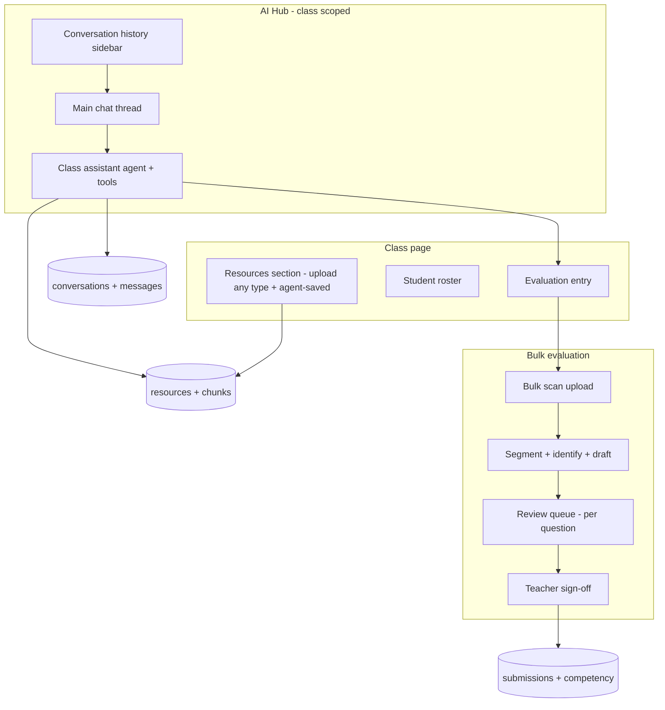
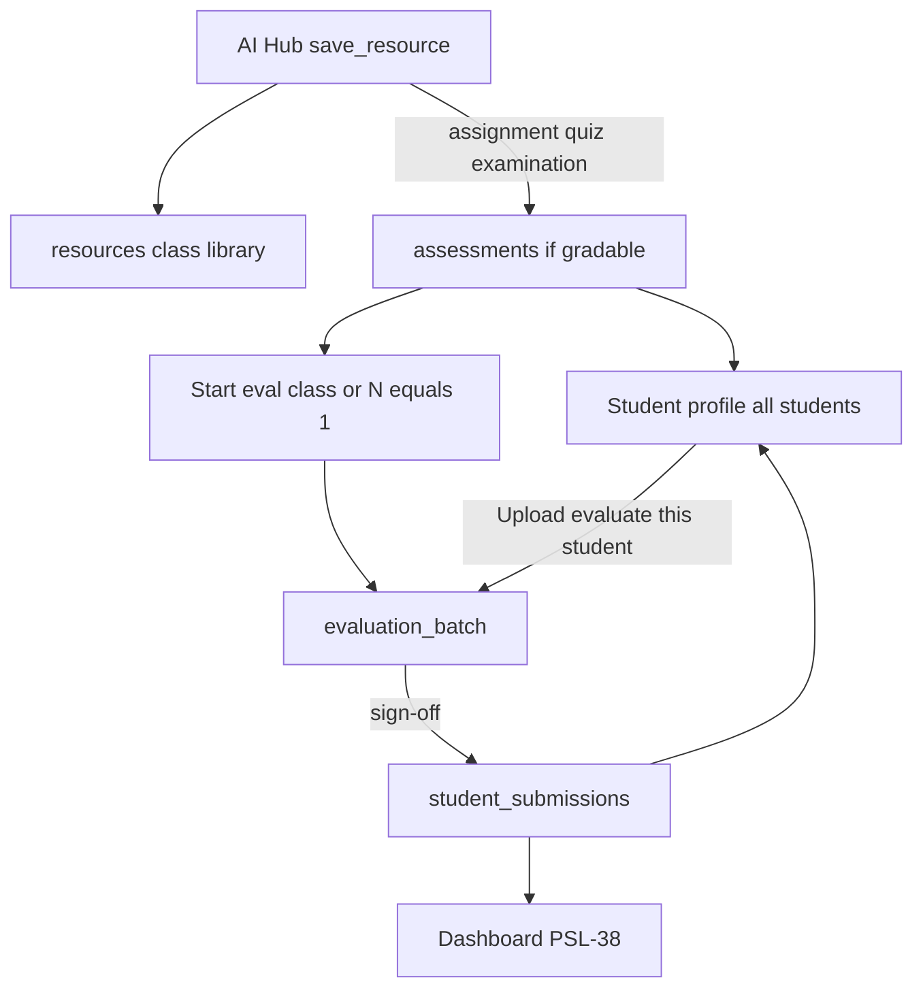
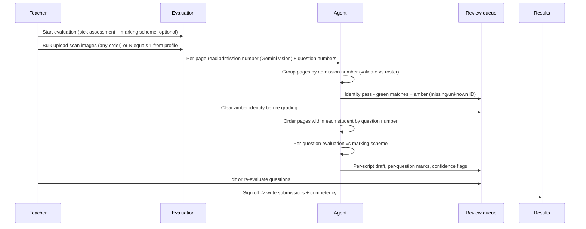

# v1.0 Program Specs — Agent-centric model (Confluence mirror)

**Status:** Sprint 3 **Complete** (merged 2026-07-08); Sprints 4–6 draft for requirements sign-off (Phase 0)
**Confluence:** [v1.0 Program Specs — Agent-centric (Sprints 3–6)](https://nervustechnologies.atlassian.net/wiki/spaces/PLEARN/pages/8388609/v1.0+Program+Specs+Agent-centric+Sprints+3+6) (index page; full ACs below)
**Epic:** [PSL-3 — v1.0 Program: Agent-centric MVP](https://nervustechnologies.atlassian.net/browse/PSL-3)

Publish updates under [PLEARN Specs](https://nervustechnologies.atlassian.net/wiki/spaces/PLEARN/pages/5767169/Specs).

---

## Product vision

Make the teaching lifecycle **efficient and inclusive** for the educator by integrating AI (RAG + agents) into the tools they already reach for. Kenyan classrooms are pen-and-paper first, so the product must bridge physical work and digital assistance.

**Design principle for v1.0: simplicity.** One conversational surface, one place for class materials, one evaluation workflow. Agents do the heavy lifting; teachers stay in control through explicit confirmation before anything is written or finalized.

## Three surfaces (the whole product)

1. **AI Hub** — class-scoped chat with a conversation history sidebar (like a normal LLM platform). A single **class assistant agent** can query, generate any learning resource, and act (save, kick off evaluation) — always asking before it writes.
2. **Class page** — a **resources section** for that class (upload any file type + agent-saved content), the student roster, and an entry point to evaluation.
3. **Bulk evaluation** — upload a stack of scanned scripts, the agent groups them per student by admission number and drafts per-question feedback against a marking scheme, and the teacher reviews and signs off before results are saved.

## Sprint map (re-sliced for simplicity)

| Sprint | Capability | Teacher outcome |
|--------|------------|-----------------|
| **Sprint 3** | AI Hub v2 | Class-scoped chat + history sidebar + assistant agent that queries, generates any resource, and saves on confirmation |
| **Sprint 4** | Class resources | A resources section per class: upload any file type, view, open, delete; unifies agent-saved + uploaded materials |
| **Sprint 5** | Bulk evaluation | Bulk scan upload → group by admission number → identify → per-question drafts → review queue → sign-off → student results |
| **Sprint 6** | Polish + production | Dashboard summary, simple report export, optional PWA, production launch + `v1.0.0` |

## Process gates (all sprints)

- No `feature/` branch until this spec section for the ticket is **Approved**.
- One Jira ticket → one branch → one PR.
- Apply new migrations on **dev Supabase** before manual QA for that PR.
- Tests ship in the same PR as the feature ([docs/testing.md](./testing.md)).
- The agent **asks before any write** (save resource, finalize evaluation, delete).

## What we keep vs retire

| Keep (on `develop` from Sprint 2) | Retire from earlier Sprint 3 draft |
|-----------------------------------|------------------------------------|
| `queryClassResources` / RAG (`src/lib/ai/rag.ts`) | Separate `/generate` page |
| `ingestTxtResource` pipeline (`src/lib/ai/ingest-resource.ts`) | Global `/resources` library page |
| `resources` + `resource_chunks` tables | Topic-picker parsing rules |
| Class page + roster | Single-photo feedback card |
| AI Hub route (`/ai-hub`) | Thin one-shot co-pilot panel as final UX |

## Jira mapping (re-scoped July 2026)

| Sprint | Ticket | Scope | Merge order |
|--------|--------|-------|-------------|
| **3** | [PSL-42](https://nervustechnologies.atlassian.net/browse/PSL-42) | AI Hub v2 — chat UI + conversation history | 1st |
| **3** | [PSL-7](https://nervustechnologies.atlassian.net/browse/PSL-7) | Class assistant agent — generate any resource | 2nd |
| **3** | [PSL-27](https://nervustechnologies.atlassian.net/browse/PSL-27) | Agent save-on-confirm to class resources | 3rd |
| **4** | [PSL-43](https://nervustechnologies.atlassian.net/browse/PSL-43) | Class resources section — upload any file type | — |
| **5** | [PSL-8](https://nervustechnologies.atlassian.net/browse/PSL-8) | **Umbrella** — Bulk evaluation + student bridge (do not mega-PR) | — |
| **5** | [PSL-44](https://nervustechnologies.atlassian.net/browse/PSL-44) | Schema + start + upload; gradable save → assessment | 1st |
| **5** | [PSL-45](https://nervustechnologies.atlassian.net/browse/PSL-45) | Identity + grouping (Gemini tiered vision) | 2nd |
| **5** | [PSL-46](https://nervustechnologies.atlassian.net/browse/PSL-46) | Per-question drafts | 3rd |
| **5** | [PSL-47](https://nervustechnologies.atlassian.net/browse/PSL-47) | Review queue + sign-off | 4th |
| **5** | [PSL-48](https://nervustechnologies.atlassian.net/browse/PSL-48) | Roster student profile + `N=1` eval | 5th |
| **5** | [PSL-38](https://nervustechnologies.atlassian.net/browse/PSL-38) | Dashboard competency snapshot | 6th |
| **6** | [PSL-10](https://nervustechnologies.atlassian.net/browse/PSL-10) | Simple report export | — |
| **6** | [PSL-39](https://nervustechnologies.atlassian.net/browse/PSL-39) | PWA offline shell (optional) | — |
| **6** | [PSL-40](https://nervustechnologies.atlassian.net/browse/PSL-40) | Production Supabase | before PSL-41 |
| **6** | [PSL-41](https://nervustechnologies.atlassian.net/browse/PSL-41) | Production deploy + `v1.0.0` | last |

**Epic:** [PSL-3 — v1.0 Program: Agent-centric MVP](https://nervustechnologies.atlassian.net/browse/PSL-3)

**Note:** PSL-9 (Day 1 co-pilot) remains **Done** from Sprint 2; not reopened. PSL-42 extends the AI Hub UX.

---

## Sprint 3 — AI Hub v2 (conversational agent)

**Status:** Approved (2026-07-06)  
**Labels:** `area-ai-rag`, `type-feature`  
**Depends on:** PSL-6, PSL-9 (merged on `develop`)  
**Merge order:** PSL-42 → PSL-7 → PSL-27

### User story

As a CBC teacher, I want an AI Hub that works like a normal chat platform — a main conversation with history on the side — where a class-scoped assistant can answer questions about my materials, generate any learning resource, and save what I approve, so I have one place to get teaching work done.

### Sprint-level acceptance criteria (AC-3.1–AC-3.9)

Full Given/When/Then ACs are distributed per ticket below. Cross-ticket summary:

| AC | Ticket | Summary |
|----|--------|---------|
| AC-3.1 | PSL-42 | Chat layout + history sidebar |
| AC-3.2 | PSL-42 | Class-scoped conversations |
| AC-3.3 | PSL-42 | New conversation persistence |
| AC-3.4 | PSL-42 | Resume conversation |
| AC-3.5 | PSL-7 | RAG query with citations |
| AC-3.6 | PSL-7 | Generate any resource (draft only) |
| AC-3.7 | PSL-27 | Save on confirmation |
| AC-3.8 | PSL-42 (+ PSL-7/27 tool errors) | Streaming + error handling |
| AC-3.9 | All three | Authorization 403 |

---

### PSL-42 — AI Hub v2 — chat UI + conversation history

**Branch:** `feature/PSL-42-ai-hub-chat-history`  
**Depends on:** PSL-6, PSL-9

#### Technical scope

| Item | Detail |
|------|--------|
| UI | `/ai-hub` — main chat thread + conversation history sidebar + new-conversation action |
| Chat API | `POST /api/ai-hub/chat` — streaming shell (`streamText`; tools stubbed until PSL-7) |
| Conversations API | `GET/POST /api/ai-hub/conversations`, `GET /api/ai-hub/conversations/[id]` |
| Model | `getChatModel()` via DeepSeek ([ADR-003](./adr-003-ai-provider-rag.md)) |
| Persistence | New `conversations` + `conversation_messages` tables + RLS |
| Class scope | Conversations belong to the active class (header selector) |

#### Acceptance criteria

**AC-3.1 — Chat layout with history sidebar**

- **Given** I open `/ai-hub` with an active class
- **When** the page loads
- **Then** I see a main chat thread and a sidebar listing my prior conversations for this class, newest first

**AC-3.2 — Class-scoped conversations**

- **Given** I switch the active class in the header
- **When** the AI Hub reloads
- **Then** the sidebar shows conversations for the newly selected class only

**AC-3.3 — New conversation**

- **Given** I am in AI Hub
- **When** I start a new conversation and send a message
- **Then** a `conversations` row is created for the active class with an auto-generated title from the first message
- **And** my message and the assistant reply are persisted as `conversation_messages`

**AC-3.4 — Resume conversation**

- **Given** I click a conversation in the sidebar
- **When** it loads
- **Then** the full message history renders in order

**AC-3.8 — Streaming + error handling (chat shell)**

- **Given** I send a message
- **When** the model responds
- **Then** the reply streams token-by-token
- **And** on model failure I see a user-facing error with a retry option (no raw stack trace)

**AC-3.9 — Authorization**

- **Given** I do not own the active class
- **When** any AI Hub conversation or chat API is called for it
- **Then** the response is 403

#### Tests (same PR)

- Unit: conversation title generation; message persistence order
- API route tests: conversations CRUD, chat streaming (mocked), 403

---

### PSL-7 — Class assistant agent — generate any resource

**Branch:** `feature/PSL-7-class-assistant-generate`  
**Depends on:** PSL-42 merged

#### Technical scope

| Item | Detail |
|------|--------|
| Chat API | Extend `POST /api/ai-hub/chat` — `streamText` + agent tools |
| Tools | `search_class_resources`, `generate_learning_resource`, `list_students` (no writes) |
| RAG | Reuse `queryClassResources` from `src/lib/ai/rag.ts` |
| Model | DeepSeek via `getChatModel()` |

#### Acceptance criteria

**AC-3.5 — Query grounded in class resources**

- **Given** my class has ingested resources
- **When** I ask a question about them
- **Then** the assistant uses `search_class_resources` and answers with citations (resource titles)

**AC-3.6 — Generate any resource type**

- **Given** I ask the assistant to create a scheme of work / assignment / notes / marking scheme
- **When** it responds
- **Then** it returns a draft in the chat
- **And** it does **not** save automatically

**AC-3.8 — Streaming + error handling (tool failures)**

- **Given** a tool call fails during chat
- **When** the error surfaces
- **Then** I see a user-facing error with a retry option (no raw stack trace)

**AC-3.9 — Authorization**

- **Given** I do not own the active class
- **When** the chat API with tools is called for it
- **Then** the response is 403

#### Tests (same PR)

- Unit: agent tool routing (mock model) — query vs generate intents
- Unit: RAG citations in tool responses
- API route test for chat with tools (mocked streaming)

---

### PSL-27 — Agent save-on-confirm to class resources

**Branch:** `feature/PSL-27-agent-save-on-confirm`  
**Depends on:** PSL-7 merged

#### Technical scope

| Item | Detail |
|------|--------|
| Tool | `save_resource` — persist draft to class resources + ingest for RAG |
| Confirm gate | Agent asks in chat before calling `save_resource` (no silent writes) |
| Ingest | Reuse `ingestTxtResource` from `src/lib/ai/ingest-resource.ts` |
| Metadata | Sets `resource_type`, `ai_generated: true` on `resources` |

#### Acceptance criteria

**AC-3.7 — Save on confirmation**

- **Given** the assistant produced a draft resource
- **When** it offers to save and I confirm (e.g. "yes, save as an assignment")
- **Then** `save_resource` persists it to the active class with the inferred `resource_type` and `ai_generated: true`
- **And** the content is ingested into `resource_chunks` for future RAG
- **And** I see confirmation in the chat with the saved title and type

**AC-3.8 — Streaming + error handling (save failures)**

- **Given** `save_resource` fails
- **When** the error surfaces
- **Then** I see a user-facing error with a retry option (no raw stack trace)

**AC-3.9 — Authorization**

- **Given** I do not own the active class
- **When** save is attempted for that class
- **Then** the response is 403

#### Tests (same PR)

- Unit: `save_resource` sets `resource_type` + `ai_generated`, triggers ingest (mocked Supabase)
- Unit: no save without teacher confirmation in conversation flow

---

### Sprint 3 — shared reference

#### Agent tools (full MVP after PSL-27)

| Tool | Behavior | Write? | Ticket |
|------|----------|--------|--------|
| `search_class_resources` | RAG retrieval + citations | No | PSL-7 |
| `generate_learning_resource` | Produce content; agent infers type | No (draft only) | PSL-7 |
| `save_resource` | Persist draft + ingest for RAG | **Yes — confirm first** | PSL-27 |
| `list_students` | Read roster for context | No | PSL-7 |

#### Data model (new in PSL-42)

- `conversations`: `id`, `class_id` (FK), `teacher_id` (FK), `title`, `created_at`, `updated_at`
- `conversation_messages`: `id`, `conversation_id` (FK), `role` (`user`/`assistant`/`tool`), `content`, `tool_calls` (JSONB, nullable), `created_at`
- RLS: teacher can access conversations only for classes they own.

### Out of scope (Sprint 3)

- Multi-format file upload (Sprint 4 — TXT ingest from Sprint 2 still available)
- Bulk evaluation tools (Sprint 5)
- Editing saved resources (Sprint 4 resources section)
- Multi-agent orchestration (single assistant only)

### Tests (same PR)

- Unit: agent tool routing (mock model) — query vs generate vs save intents
- Unit: `save_resource` sets `resource_type` + `ai_generated`, triggers ingest (mocked Supabase)
- Unit: conversation title generation; message persistence order
- API route test for chat (mocked streaming) and conversations CRUD

### Manual QA script

1. Open AI Hub with a class that has an ingested scheme.
2. Ask "What does Week 3 cover?" → confirm cited answer.
3. Ask "Create a Grade 7 fractions assignment" → confirm draft, no auto-save.
4. Say "Save it as an assignment" → confirm saved + appears for RAG.
5. Start a second conversation; switch classes; confirm sidebar scoping.

---

## Sprint 4 — Class resources section

**Labels:** `area-classes`, `type-feature`
**Depends on:** Sprint 3 merged

### User story

As a CBC teacher, I want a resources section on each class page where I can upload any type of material and see everything (uploaded or AI-generated) in one list, so all content for a class lives in one simple place.

### Technical scope

| Item | Detail |
|------|--------|
| UI | Resources section on `/classes/[classId]` (list + upload + open + delete) |
| Upload API | Extend `/api/resources/ingest` for multi-format |
| Formats (MVP) | TXT, PDF, images (JPEG/PNG) → extract text → chunk → embed |
| Text extraction | TXT: direct read; PDF: `unpdf` (local); images: **Gemini 2.5 Flash** ([ADR-003](./adr-003-ai-provider-rag.md)) |
| Later | DOCX and others via added extractors |
| Ingest | Reuse chunk + embed pipeline; store original file in storage |

### Acceptance criteria

**AC-4.1 — Resources list per class**

- **Given** I open a class page
- **When** the resources section renders
- **Then** I see all active resources for that class with title, type, source (uploaded vs AI-generated), and date

**AC-4.2 — Upload any supported type**

- **Given** I upload a TXT, PDF, or image (JPEG/PNG, max size enforced)
- **When** upload completes
- **Then** text is extracted, chunked, embedded, and the resource appears in the list
- **And** unsupported types show a clear message (not a 500)

**AC-4.3 — Open a resource**

- **Given** a resource in the list
- **When** I open it
- **Then** I can view its content (and download the original file if applicable)

**AC-4.4 — Delete with confirmation**

- **Given** a resource in the list
- **When** I delete it and confirm
- **Then** the storage object, `resources` row, and `resource_chunks` are removed

**AC-4.5 — Unified with agent-saved resources**

- **Given** the AI Hub agent saved a resource (Sprint 3)
- **When** I view the class resources section
- **Then** it appears in the same list with an AI-generated indicator

**AC-4.6 — Authorization**

- **Given** I do not own the class
- **When** any resources API is called
- **Then** the response is 403

### Out of scope (Sprint 4)

- Full rich-text editing of resources (view + delete for MVP; edit optional follow-up)
- Folder/tag organization
- Non-MVP formats (DOCX, etc.)

### Tests (same PR)

- Unit: format detection + extraction dispatch (TXT/PDF/image), unsupported rejection
- API route tests: list, upload, delete

### Manual QA script

1. Open a class; upload a PDF scheme → confirm indexed and listed.
2. Upload an image → confirm extraction + listing.
3. Open a resource; delete another with confirmation.
4. Confirm an AI Hub-saved resource shows in the same list.

---

## Sprint 5 — Bulk evaluation + student bridge

**Labels:** `area-ai-rag` / `area-dashboard`, `type-feature`  
**Depends on:** Sprint 4 merged (needs class resources for marking schemes)  
**Parent:** [PSL-8](https://nervustechnologies.atlassian.net/browse/PSL-8) (umbrella) under epic [PSL-3](https://nervustechnologies.atlassian.net/browse/PSL-3)  
**Merge order:** [PSL-44](https://nervustechnologies.atlassian.net/browse/PSL-44) → [PSL-45](https://nervustechnologies.atlassian.net/browse/PSL-45) → [PSL-46](https://nervustechnologies.atlassian.net/browse/PSL-46) → [PSL-47](https://nervustechnologies.atlassian.net/browse/PSL-47) → [PSL-48](https://nervustechnologies.atlassian.net/browse/PSL-48) → [PSL-38](https://nervustechnologies.atlassian.net/browse/PSL-38)

### User story

As a CBC teacher, I want to bulk- or single-upload scanned pen-and-paper scripts and have the AI group them per student by admission number, draft per-question feedback against a marking scheme, and let me review and correct before signing off — and I want assignments saved from AI Hub to appear on every student profile immediately so I can evaluate one student without waiting for a class-wide batch.

### Product model — resource vs assessment vs batch

**Selective publish on save:** when the agent confirms `save_resource` for a **gradable** type (`assignment`, `quiz`, `examination`), write both the class-library `resources` row **and** a linked class-level `assessments` row. That assessment appears on **every** student profile immediately as `not_started`.

Non-gradable saves (`lesson_notes`, `scheme_of_work`, `marking_scheme`, `other`) stay **resources only**.

- **Resource** = material in the class library (all types).
- **Assessment** = class graded event, created **at save** for gradable types (linked to the resource); also creatable when starting eval from an uploaded assignment that was never chat-saved.
- **Batch** = one grading run for 1..N students against an assessment. Physical stack order never matters; admission # on every page is the primary key.

### Workflow

### Grouping + identity logic

**Prerequisite (student-facing ask):** every page carries the student's **admission number**. This is a simple classroom habit and it becomes the primary key for the whole evaluation flow.

- **Primary key — admission number per page:** read the admission number on **every** page with the **Gemini tiered vision stack** (Flash-Lite default, Pro escalation) — handwriting recognition is done by the vision LLM, **not traditional OCR** (see reliability note below). Validate each read against the class roster allowlist.
- **Grouping (replaces stack-order segmentation):** group all pages by admission number. Physical stack order is irrelevant — interleaved or shuffled pages reconcile automatically because each page self-identifies.
- **Identity confidence:** ID present and in roster = **green** (auto-grouped); missing, unreadable, or not-in-roster = **amber** — the agent proposes a best guess (from content continuity / handwriting) and the teacher confirms against the image.
- **Ordering (secondary signal):** within a student, order pages by detected **question numbers**. Question numbers no longer segment scripts — they only order pages within a student and tell the agent which question each answer belongs to (needed for grading anyway). A page may hold several questions (carries a range).
- **Missing page flag:** a gap in a student's question numbers flags "possible missing page" (amber).
- **Conflict flag:** the same admission number + same question number on two pages flags a conflict (possible second attempt or misread) for the teacher, rather than silently choosing one.
- **Pipeline order:** resolve identity/grouping for the **whole batch first**; the teacher clears amber identities; only then spend vision calls on per-question grading (no wasted grading on mis-attributed pages).

**Handwriting reliability note:** traditional OCR performed poorly on handwritten scripts in testing; multimodal LLMs read the same handwriting reliably (early tests used Grok; production uses **Gemini tiered vision** per [ADR-003](./adr-003-ai-provider-rag.md)). All handwriting reading — admission numbers, question numbers, and answers — goes through the vision model.

### Marking scheme

- A marking scheme is just a **resource** with `resource_type: marking_scheme` (generated + approved in AI Hub, or uploaded).
- At evaluation start the teacher picks a scheme, or the agent offers to generate one.
- **No scheme attached:** the teacher is informed — "AI will grade using its own judgment, less reliable" — and may proceed. All resulting marks are flagged **amber (AI estimate)**.

### Data model (new)

- `assessments.resource_id` (nullable FK) — links a class assessment to its library resource when created from gradable `save_resource` or eval start.
- `evaluation_batches`: `id`, `class_id`, `assessment_id` (nullable), `marking_scheme_resource_id` (nullable), `status` (`draft`/`in_review`/`signed_off`), `created_at`
- `evaluated_scripts`: `id`, `batch_id`, `student_id` (nullable until matched), `read_admission_number` (text, nullable), `match_confidence` (`high`/`low`), `page_order` (JSONB of storage paths ordered by question number), `status`
- `question_evaluations`: `id`, `script_id`, `question_number`, `awarded`, `max`, `feedback`, `status` (`ai_draft`/`ai_estimate`/`teacher_edited`/`reevaluated`), `created_at`
- On sign-off: write `student_submissions` (feedback) + upsert `competency_progress` (existing tables).

### Phase 0 — Vision benchmark (before Ticket 2)

Benchmark Gemini Lite → Flash → Pro on **20–30 real Kenyan handwritten script samples** before identity coding. Record escalation thresholds in [ADR-003](./adr-003-ai-provider-rag.md). Ticket 1 may ship schema/upload without the full tier stack; Ticket 2 must not open until Phase 0 notes are recorded.

### Cross-ticket AC summary

| AC | Ticket | Summary |
|----|--------|---------|
| AC-5.1 | PSL-44 | Start evaluation + marking scheme choice |
| AC-5.2 | PSL-44 | Bulk upload |
| AC-5.16 | PSL-44 | Gradable save publishes assessment to profiles |
| AC-5.3 | PSL-45 | Group pages by admission number |
| AC-5.4 | PSL-45 | Identity confidence + fallback |
| AC-5.8 | PSL-45 | Fix identity in review |
| AC-5.9 | PSL-45 | Missing page handling |
| AC-5.12 | PSL-45 | Duplicate ID + question conflict |
| AC-5.5 | PSL-46 | Per-question drafts |
| AC-5.6 | PSL-47 | Review queue: manual edit |
| AC-5.7 | PSL-47 | Review queue: single-question re-evaluation |
| AC-5.10 | PSL-47 | Sign-off writes results |
| AC-5.11 | PSL-47 (+ PSL-38) | Cache invalidation / dashboard refresh |
| AC-5.13 | PSL-48 | Student profile lists assessments |
| AC-5.14 | PSL-48 | Evaluate / upload for one student (`N=1`) |
| AC-5.15 | PSL-48 | View signed-off feedback on profile |

---

### PSL-44 — Schema + start + upload

**Branch:** `feature/PSL-44-eval-schema-upload`  
**Labels:** `area-ai-rag`, `type-feature`  
**Depends on:** PSL-43  
**Phase 0:** document Gemini benchmark requirement on this ticket / ADR-003 (full benchmark before PSL-45)

#### Technical scope

| Item | Detail |
|------|--------|
| Migration | `evaluation_batches`, `evaluated_scripts`, `question_evaluations` + RLS; `assessments.resource_id`; `student_submissions` storage RLS if missing |
| Gradable save | Extend `save_resource` so `assignment` / `quiz` / `examination` inserts resource **and** linked `assessments` row (idempotent) |
| UI | Class page CTA: Start evaluation; scheme pick / generate / proceed-without notice; multi-image upload |
| Auth | `requireTeacherClass` on all new APIs |

#### Acceptance criteria

**AC-5.1 — Start evaluation + marking scheme choice**

- **Given** I start an evaluation for a class
- **When** the setup opens
- **Then** I can attach an existing marking scheme, generate one, or proceed without
- **And** proceeding without shows the reduced-reliability notice

**AC-5.2 — Bulk upload**

- **Given** I have scanned scripts as images
- **When** I upload them in one batch (any order)
- **Then** all pages are stored and queued for processing

**AC-5.16 — Gradable save publishes to profiles**

- **Given** I confirm saving an assignment/quiz/examination in AI Hub
- **When** `save_resource` succeeds
- **Then** the item appears in the class library **and** a class `assessments` row exists linked to it
- **And** every student profile lists that assessment as `not_started` until a batch/submission exists for that student

#### Tests (same PR)

- Unit: gradable `save_resource` creates linked assessment; non-gradable does not
- API: batch create + upload auth (403 for non-owner)

---

### PSL-45 — Identity + grouping

**Branch:** `feature/PSL-45-eval-identity`  
**Labels:** `area-ai-rag`, `type-feature`  
**Depends on:** PSL-44 merged + Phase 0 benchmark recorded

#### Technical scope

| Item | Detail |
|------|--------|
| Vision | Extend `vision-model.ts` to Lite → Flash → Pro per ADR-003 |
| Pipeline | Per-page admission # + question numbers; group by admission #; roster validate; amber confirm **before** grading |
| Flags | Missing-page gap; duplicate admission+question conflict |

#### Acceptance criteria

**AC-5.3 — Group pages by admission number**

- **Given** a stack containing multiple students' pages in any order
- **When** processing runs
- **Then** every page's admission number is read with the Gemini vision model and validated against the class roster
- **And** pages are grouped per student by admission number (physical stack order irrelevant; interleaved pages reconcile)
- **And** pages within a student are ordered by detected question number

**AC-5.4 — Identity confidence + fallback**

- **Given** pages are grouped
- **When** a page's admission number is missing, unreadable, or not in the roster
- **Then** that page/script is flagged amber with the agent's best-guess student
- **And** the teacher confirms or reassigns against the image **before** grading runs

**AC-5.8 — Fix identity in review**

- **Given** an amber-flagged student match
- **When** I pick the correct student from a dropdown
- **Then** the script reassigns to that student

**AC-5.9 — Missing page handling**

- **Given** a script has a question-number gap
- **When** I view it in review
- **Then** I see a "possible missing page" warning and can still proceed or add a page

**AC-5.12 — Duplicate ID + question conflict**

- **Given** two pages share the same admission number and the same question number
- **When** grouping runs
- **Then** a conflict is flagged for the teacher (possible second attempt or misread)
- **And** the system does not silently choose one page

#### Tests (same PR)

- Unit: grouping by admission number; roster validation; amber on missing/unknown ID
- Unit: ordering by question number; missing-page gap flag; duplicate ID+Q conflict

---

### PSL-46 — Per-question drafts

**Branch:** `feature/PSL-46-eval-drafts`  
**Labels:** `area-ai-rag`, `type-feature`  
**Depends on:** PSL-45 merged

#### Acceptance criteria

**AC-5.5 — Per-question drafts**

- **Given** a marking scheme is attached
- **When** drafting runs (only for identity-cleared scripts)
- **Then** each question has an awarded mark, max, and feedback, graded against the scheme
- **And** without a scheme, marks are produced but flagged `ai_estimate`

#### Tests (same PR)

- Unit: no-scheme path flags `ai_estimate`
- API: draft route mocked vision; skips scripts with uncleared amber identity

---

### PSL-47 — Review + sign-off

**Branch:** `feature/PSL-47-eval-review-signoff`  
**Labels:** `area-ai-rag`, `type-feature`  
**Depends on:** PSL-46 merged

#### Acceptance criteria

**AC-5.6 — Review queue: manual edit**

- **Given** I review a script
- **When** I change a question's mark or feedback
- **Then** that question's status becomes `teacher_edited` and the script total recomputes

**AC-5.7 — Review queue: single-question re-evaluation**

- **Given** I want the AI to retry one question
- **When** I click Re-evaluate and optionally add an instruction (e.g. "valid alternative method, award method marks")
- **Then** the agent re-scores **only that question** using the page image(s) for it + the marking scheme + my instruction
- **And** only that question updates (status `reevaluated`); all other reviewed questions are untouched
- **And** the script total and competency mapping recompute

**AC-5.10 — Sign-off writes results**

- **Given** I have reviewed a script
- **When** I sign off
- **Then** `student_submissions` + `competency_progress` are written for that student
- **And** nothing is written before sign-off (drafts stay pending)

**AC-5.11 — Cache invalidation**

- **Given** I signed off scripts
- **When** I open the dashboard
- **Then** competency reflects the updates without manual refresh

#### Tests (same PR)

- Unit: single-question re-evaluation updates only the target question + recomputes total
- API: sign-off writes submissions; 403 for non-owner

---

### PSL-48 — Roster student profile

**Branch:** `feature/PSL-48-student-eval-profile`  
**Labels:** `area-classes`, `type-feature`  
**Depends on:** PSL-47 merged

#### Acceptance criteria

**AC-5.13 — Student profile lists assessments**

- **Given** class assessments exist (including ones just saved from chat)
- **When** I click a student in the roster
- **Then** a profile shows identity + those assessments with that student’s status (`not_started` / `in_review` / `signed_off`) and mark summary when signed off

**AC-5.14 — Evaluate / upload for one student**

- **Given** I am on a student profile
- **When** I choose Evaluate / Upload work for an assessment
- **Then** I enter the same eval pipeline scoped to that student (`N=1` batch)

**AC-5.15 — View signed-off feedback**

- **Given** a signed-off submission exists
- **When** I open the profile
- **Then** I can view feedback for that assessment without re-running vision

#### Tests (same PR)

- Unit/API: profile lists assessments with derived per-student status; `N=1` batch create scoped to student

---

### PSL-38 — Dashboard competency snapshot

**Branch:** `feature/PSL-38-dashboard-competency`  
**Labels:** `area-dashboard`, `type-feature`  
**Depends on:** PSL-47 (sign-off writes) — ideally after PSL-48

Replace dashboard placeholder with per-student competency from `competency_progress` after sign-off; reflect updates without manual refresh (AC-5.11 consumer).

---

### Out of scope (Sprint 5)

- Auto-create assessments for **non-gradable** resource types (notes, schemes, marking schemes)
- Auto-detecting the assessment/topic from the scripts (teacher selects/enters)
- Cross-batch analytics
- Non-image scan formats (images only for MVP)
- Original-vs-revised mark audit trail (nice-to-have)
- Term-level analytics / report PDF (PSL-10)

### Manual QA script (end-to-end after PSL-48 + PSL-38)

1. Generate + approve an assignment and a marking scheme in AI Hub; confirm assignment appears on a student profile as `not_started`.
2. Start evaluation, attach the scheme, bulk-upload a **shuffled** mixed stack of scripts (pages out of order).
3. Confirm pages group per student by admission number and reconcile despite the shuffle.
4. Leave one page without an ID; confirm it is amber; assign the student from the image.
5. Re-evaluate one question with an instruction; confirm only it changes.
6. Sign off; confirm results on dashboard and on the student profile.
7. From another student’s profile, upload `N=1` pages for the same assessment.
8. Repeat once without a scheme; confirm amber estimate flags + notice.

---

## Sprint 6 — Polish + production

**Labels:** `area-infra` / `area-dashboard`, `type-feature` / `type-chore`
**Depends on:** Sprints 3–5 merged

### Scope (kept intentionally small)

| Item | Acceptance summary |
|------|--------------------|
| Dashboard summary | Class overview: student count, links to AI Hub and pending evaluations; competency snapshot per student (all students, no cap) |
| Report export | Simple per-student export (print CSS → Save as PDF) including competency + feedback history |
| PWA (optional) | If time allows: `sw.js` app-shell precache + `/offline` fallback; else defer post-v1.0 |
| Production Supabase | Separate project; full migration chain; auth + RLS smoke test |
| Production deploy | Vercel prod env; `develop` → `main`; tag `v1.0.0` |

### Production MVP acceptance checklist (run on production URL)

1. Teacher signs in (Google or email)
2. Creates class; uploads a resource; ingest succeeds
3. AI Hub: query with citation; generate + save a resource on confirm
4. Class resources section shows uploaded + AI-generated items
5. Bulk evaluation: upload stack → review → sign off → results saved
6. Dashboard shows competency for all students
7. Report export includes feedback history
8. `npm test` + `npm run build` green on `main`; tag `v1.0.0` exists

---

## Resolved decisions (Phase 0 sign-off)

| # | Decision |
|---|----------|
| 1 | Save/sign-off gate: agent **always asks in chat** before writing (no silent auto-save) |
| 2 | Bulk-evaluation grouping: **full multi-student stack**, grouped by **admission number on every page** (primary key); physical order irrelevant, shuffled/interleaved pages reconcile |
| 3 | Identity matching: **admission number per page** validated against roster; missing/unknown ID → amber, teacher confirms against image before grading; duplicate ID+question → conflict flag |
| 4 | Question numbers are the **secondary signal** — order pages within a student + identify which question is graded (not segmentation); multi-question pages carry a range |
| 4b | Handwriting read by **Gemini tiered vision, not OCR** — OCR tested poorly; multimodal LLM reads handwriting reliably ([ADR-003](./adr-003-ai-provider-rag.md)) |
| 5 | Single-question re-evaluation: **per-question storage** + re-eval touches only that question, with optional teacher instruction |
| 6 | Marking scheme is a **generated + approved resource**; missing scheme → inform teacher, allow model judgment flagged `ai_estimate` |
| 7 | Uploads: **any supported type** (MVP: TXT/PDF/image); extend later |
| 8 | Agents over many pages: **single class assistant with tools**, human confirm on writes |
| 9 | Gradable `save_resource` (`assignment` / `quiz` / `examination`) creates a linked class `assessments` row immediately; non-gradable types stay library-only |
| 10 | Evaluation batches support **1..N students** (class stack or single-student from roster profile); same pipeline |
| 11 | Sprint 5 delivery is **split tickets** under PSL-8 (schema → identity → drafts → review → profile → PSL-38), not one mega-PR |

## Related docs

- [ADR-003 — AI provider + RAG](./adr-003-ai-provider-rag.md)
- [Sprint 3 decision log](./sprint-3-decision-log.md)
- [Sprint 3 release notes](./sprint-3-release-notes.md)
- [Sprint 3 retrospective](./archive/retrospective-sprint-3-draft.md)
- [Testing guide](./testing.md)
- [Archived pre-replan Sprint 3 draft](./archive/sprint-3-release-notes-draft.md)
